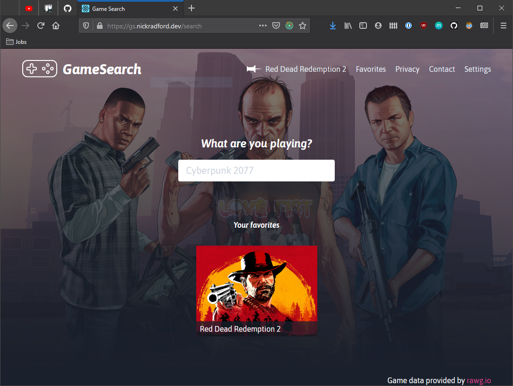

# GameSearch

A modern web application for searching and discovering video games using the RAWG Video Games Database API.



## Features

- 🎮 Search through a vast database of video games
- 🔍 Real-time search with debouncing
- 🎯 Detailed game information including ratings, platforms, and screenshots
- 📱 Responsive design that works on desktop and mobile
- 🌙 Dynamic background based on game artwork
- ⚡ Fast and modern UI built with React and Vite

## Tech Stack

- **Frontend Framework**: React 19
- **State Management**: Redux Toolkit
- **Routing**: React Router
- **Styling**: Tailwind CSS
- **Build Tool**: Vite
- **Language**: TypeScript
- **API**: RAWG Video Games Database

## Prerequisites

- Node.js (Latest LTS version recommended)
- npm or yarn
- RAWG API Key ([Get one here](https://rawg.io/apidocs))

## Setup

1. Clone the repository:
```bash
git clone https://github.com/yourusername/game-search.git
cd game-search
```

2. Install dependencies:
```bash
npm install
```

3. Create a `.env.local` file in the root directory and add your RAWG API key:
```
VITE_RAWG_API_KEY=your_api_key_here
```

4. Start the development server:
```bash
npm start
```

The application will be available at `http://localhost:5173`

## Available Scripts

- `npm start` - Starts the development server
- `npm run build` - Creates a production build
- `npm run serve` - Serves the production build locally
- `npm test` - Runs the test suite
- `npm run prettier-format` - Formats code using Prettier

## Contributing

Contributions are welcome! Please feel free to submit a Pull Request.

## License

This project is licensed under the MIT License - see the LICENSE file for details.
